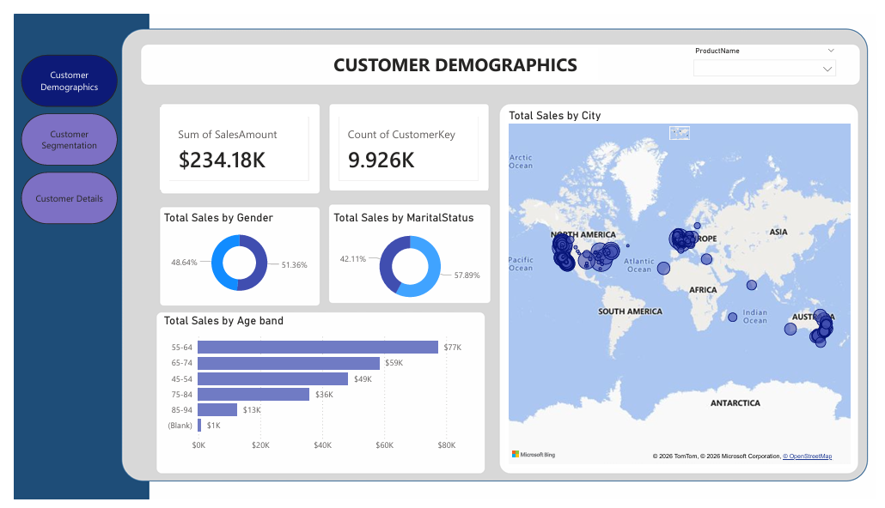
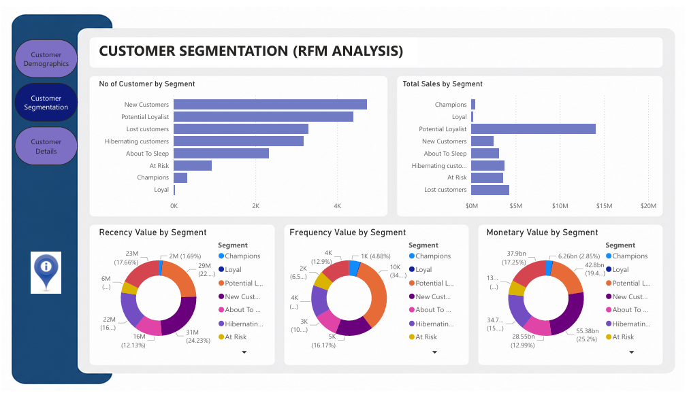
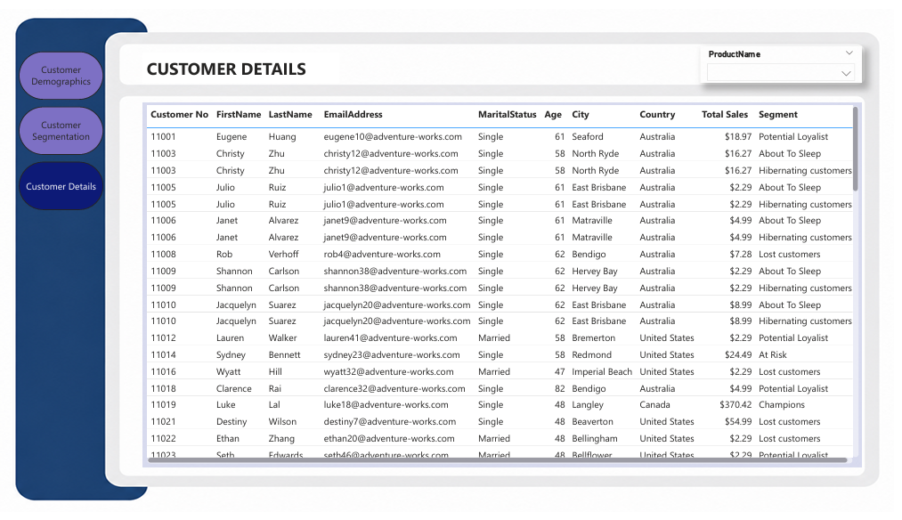
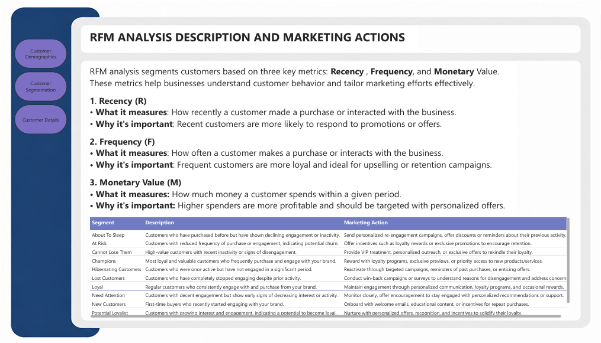

# Customer Segmentation using RFM Analysis

## 📌 Project Overview

This Power BI dashboard analyzes customer purchasing behavior using **RFM (Recency, Frequency, Monetary) Analysis**. It helps identify valuable customer segments and supports data-driven marketing decisions.

---

## 📊 Dashboard Pages

- Customer Demographics
- Customer Segmentation
- Customer Details
- Segment Description

---

## ✨ Features

- Customer Segmentation using RFM Analysis
- Customer Demographics Dashboard
- Sales Analysis
- Customer Details Analysis
- Interactive Filters and Slicers
- Geographic Sales Analysis
- Dynamic Visualizations

---

## 🛠️ Tools & Technologies

- Microsoft Power BI
- Power Query
- DAX
- Microsoft Excel
- RFM Analysis

---

## 📂 Datasets

- AdventureWorksDW.xlsx
- RFM Table.xlsx

---

## 📸 Dashboard Preview

### Customer Demographics

### Customer Segmentation

### Customer Details

### Segment Description

---

## 🚀 How to Use

1. Download the repository.
2. Open the `.pbix` file in Microsoft Power BI Desktop.
3. Refresh the data if required.
4. Explore the interactive dashboard.

---

## 👨‍💻 Author

**Sufiyan Siddiqui**

Power BI | Data Analytics | RFM Analysis
